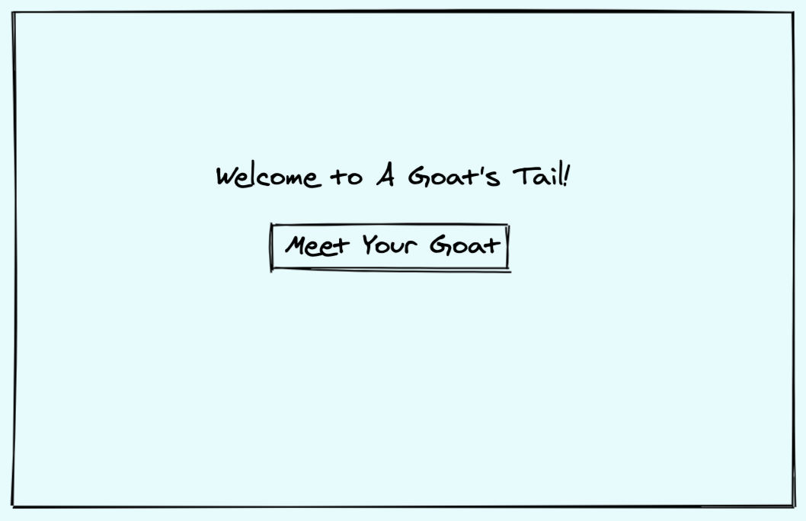
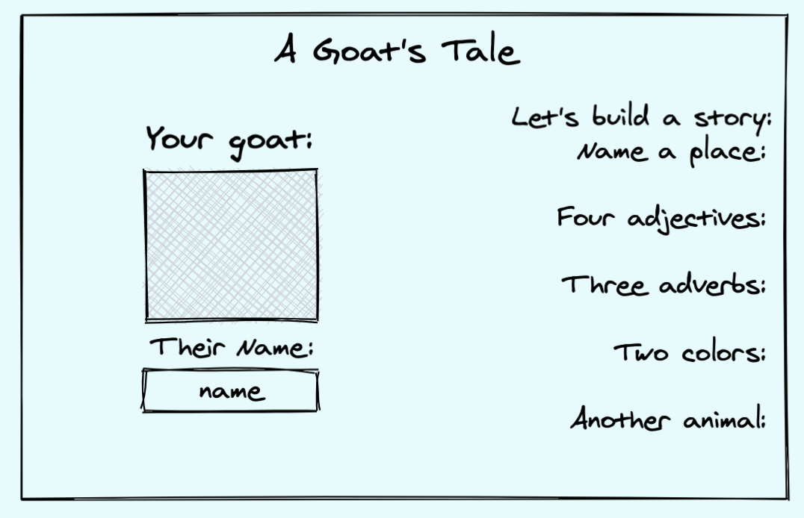

### What is this, and who is it for?
Are you a tired Mom, who is running out of bed time stories?
Do you care about parts of speech but don't know or care what a goat actually looks like?

A Goat's Tale is for you!

This interactive story building experience let's you and your little one write a "mad lib" type story based of a cute furry animal photo and words you put in. Don't like your first story? No problem! You can write another one. Like your story and want to come back to it? Great! You can save stories during your session and remember them at the bottom of the page by the cute furry friend you wrote it about, and what you named them.

### What did the idea look like?

First I wanted a welcome page

A Form To Input Story Elements
  
And last the page the final story was actually visible on, that would let a user navigate to old stories.

### How to see it in action?
- Clone Down This Repo
- Run NPM Install
- Run NPM Start
- Enjoy writing stories in your browser

### Background:
This was a project for Turing School of Software and Design's third mod final solo project. The goal was to demonstrate my ability to create a simple from scratch React App, that brings in data from an API, solves a problem for a specific user, and lets that user manipulate that data some how (favoriting).

I wanted to take a less serious approach and find a way to use a fun, seemingly functionless API, for a genuinely important user. Where the dissonance in goat verbiage and fox imagery comes in was a very last minute realization that the API I had build the project around didn't function how I had expected or hoped on a local scale, despite the tests I had run using external resources earlier.

### Where to next?
It is pretty easy to see the immediate need for either a rebrand and change of the animal in focus, or to fix the issues with the goat based API I had initially intended.
From there I would love to work to build more dynamic logic behind the story strings, so that a user could work off of an array of different stories and not just one. I enjoyed using the '(' and '*' as place holders for how I wanted the full story string to be manipulated, and I would love to work out logic where other symbols can dictate the part of speech needed in that place holder, then be able to have the necessary parts of speech dynamically render the inputs on the story form.
I think also the option for different animals immediately shows itself as room for a much more customized experience.
I would also in a stretch goal like to work to have a better story interface that looks more like a book, and could even animate as a reader's pace so that it feels more alive and engaging that a standard book, since we do already have the advantages of tech on our side.
